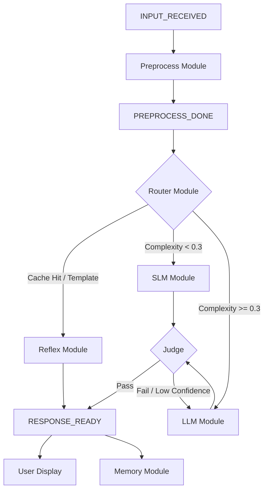

# Kitsu System Architecture Documentation (Production Grade)

## Overview
Kitsu is a local-first desktop AI companion built on a production-grade, event-driven architecture. The system utilizes an asynchronous internal message bus to decouple specialized modules, ensuring low latency, high reliability, and predictable performance on varying hardware profiles.

---

## Table of Contents
1. [Core Architectural Principles](#core-architectural-principles)
2. [Folder Structure & Package Layout](#folder-structure--package-layout)
3. [AI Processing Pipeline](#ai-processing-pipeline)
4. [Event-Driven Communication](#event-driven-communication)

---

## Core Architectural Principles

- **State via Context**: Every request is encapsulated in a `RequestContext` object. No module maintains external state for a request; all data (tokens, vibe, route, response) is carried through the pipeline.
- **Asynchronous Decoupling**: Modules never call each other directly. They subscribe to specific events and emit result events via a central `EventBus`.
- **Latency Budgets**: Strict nanosecond-precision tracking ensures the system remains responsive. If a module exceeds its budget, the system gracefully falls back to faster processing tiers.
- **Response Locking**: A strict `responded` lock in the context ensures that only one module provides the final answer to the user, preventing race conditions in multi-path routing.

---

## Folder Structure & Package Layout

The project follows the standard `src` layout for Python packaging, ensuring a clean separation between source code and metadata.

### 📂 `src/kitsu/` - Package Root
| Directory | Purpose |
|-----------|---------|
| `core/` | **Infrastructure backbone** - Contains the `EventBus` and `RequestContext`. |
| `modules/`| **Logic Components** - Specialized modules for AI processing, quality control, and features. |
| `utils/` | **Helpers** - Cross-cutting utilities like timing and budget tracking. |

### 📂 `src/kitsu/core/`
| File | Purpose |
|------|---------|
| `event_bus.py` | Asynchronous pub/sub system with support for both sync and async handlers. Includes error isolation and response locking. |
| `context.py` | Defines `RequestContext`, the single source of truth for any given user interaction. |

### 📂 `src/kitsu/modules/`
| File | Purpose |
|------|---------|
| `preprocess.py` | Computes SimHash from input and extracts emotional vibe vectors. |
| `router.py` | Analyzes complexity and cache hits to determine the optimal inference path. |
| `reflex.py` | Handles O(1) responses using a learned SimHash cache and Markov templates. |
| `slm.py` | Interface for the Small Language Model (Qwen2.5-1.5B Q4) for fast, personality-rich responses. |
| `llm.py` | Orchestrates deep reasoning loops with the Large Language Model. |
| `judge.py` | Inline quality assurance for character consistency, coherence, and factual safety. |
| `memory.py` | Updates the persistent reflex cache with high-quality LLM responses. |
| `quiz_handler.py` | Specialized handler for browser-based quizzes, bypassing the main bus for maximum performance. |

---

## AI Processing Pipeline

The pipeline implements a "Cascading Tier" approach to minimize latency while maximizing response depth.

### Path Selection Logic
1. **Reflex Path**: Triggered if the SimHash of the input exists in the learned cache or matches a known pattern template.
2. **SLM Path**: Selected for low-complexity inputs (casual chat, simple greetings). Personality injection is handled via vibe-based system prompts.
3. **LLM Path**: Engaged for reasoning-heavy queries, web search, or when the SLM fails to pass the Quality Judge.

---

## Event-Driven Communication

### The Request Lifecycle
1. **Emit**: An `INPUT_RECEIVED` event is emitted with a fresh `RequestContext`.
2. **Process**: Modules transform the context (adding SimHash, scores, or draft text) and emit downstream events.
3. **Lock**: The first module to produce a valid response calls `bus.emit("RESPONSE_READY", ctx)`.
4. **Finalize**: The `EventBus` locks the context, preventing further modifications and triggering the UI display and learning loop.

### Error Isolation
The `EventBus` wraps every handler in a try-except block. A failure in the `memory.py` module, for instance, will log a traceback but will **not** prevent the user from receiving their response.

### Latency Budgeting
The `within_budget(ctx)` helper is called at every major decision point. If the 5000ms (default) budget is nearing exhaustion, modules are instructed to terminate early and return the best available response.
