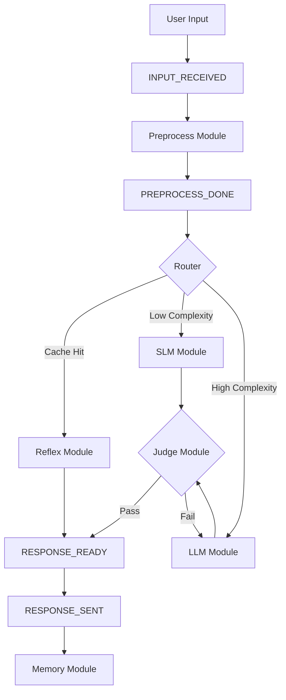

# AI Pipeline (Production Core)

## Overview

The AI pipeline uses a **Cascading Tier Strategy** to provide instant responses for common inputs while allowing deep reasoning for complex queries. The entire flow is event-driven and coordinated via a central `RequestContext`.

## Processing Flow

## 1. Preprocess Layer
- **SimHash Generation**: Computes a stable hash from sorted, deduplicated tokens (excluding stopwords).
- **Vibe Extraction**: Pulls the current 10-float emotion vector from the state engine into the `RequestContext`.

## 2. Router Layer
- **Reflex Check**: Performs an O(1) lookup in the learned cache and template registry.
- **Complexity Scoring**: Analyzes token count and keyword presence (e.g., "why", "explain") to determine if an SLM or LLM is required.

## 3. Inference Paths

### Reflex Module (Path A)
- **Learned Cache**: Direct mapping of SimHash to high-quality previous responses.
- **Markov Templates**: N-gram matcher for common patterns (time, greetings, facts).
- **Latency**: ~5ms.

### SLM Module (Path B)
- **Model**: Qwen2.5-1.5B Q4.
- **Personality**: Vibe floats are injected directly into the system prompt.
- **Latency Hard Cap**: 500ms.

### LLM Module (Path C)
- **Deep Reasoning**: Engaged for analysis or when other paths fail quality checks.
- **Reasoning Loop**: Iteratively generates and judges until a score threshold (θ ≥ 0.65) is met or the latency budget is exhausted.

## 4. Quality Judge
- **Character Signal**: Checks tone embedding against the current vibe vector.
- **Coherence Signal**: Validates sentence completion and internal consistency.
- **Safety Signal**: Conservative flagging of verifiable facts not present in context.

## 5. Learning Loop (Memory)
- High-quality LLM responses (Score ≥ 0.8) are automatically promoted to the **Reflex Cache** (JSON storage) for future O(1) retrieval.
- User style tokens (formality, length) are updated via exponential moving average.
